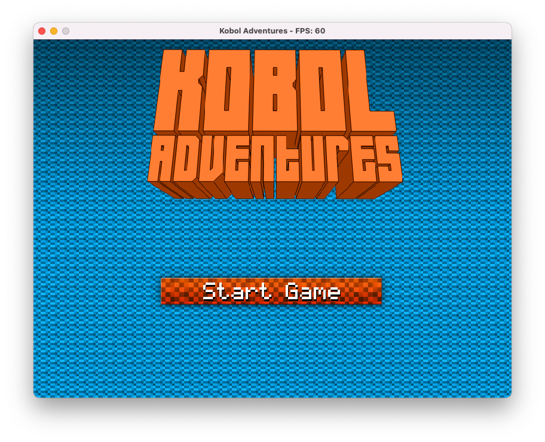

# KobolAdventures

Kobol Adventures is a very simple Minecraft clone built with Java and LWJGL 2.9.1. It was built as the final project for my OOP class back in college, it uses Vertex Buffer Objects and some culling techniques to render at a reasonable speed.


## How to run

1. Clone the repo
2. Run:
```
# In macos or linux
./gradlew run

# in Windows
gradlew.bat run
```
